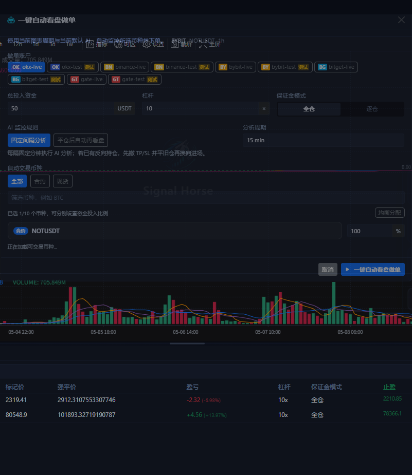
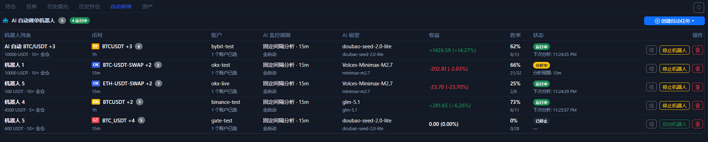

# 一键自动做单

`一键自动看盘做单` 是图表区右下角 AI 菜单里的快速启动器。它不是“立刻帮你下一笔市价单”，而是“按当前 symbol、当前周期和你选的账户，快速创建并启动自动任务”。

## 启动弹窗长什么样

这个弹窗把最常用的启动参数集中在一页里：

- 账户选择
- 总投入资金
- 杠杆
- 保证金模式
- AI 监控规则
- 分析周期
- 交易对筛选与多 symbol 选择
- 每个 symbol 的资金分配比例

## 这一步真正会做什么

点击底部启动按钮后，系统会按你选中的账户和 symbol 创建或复用 Bot 任务，并自动启动它们。

这意味着：

- 它不是只分析一次就结束。
- 它也不是只下一次单就结束。
- 如果你同时选了多个交易所账户，系统会按交易所拆成各自的任务。

## 这几个参数最重要

### 账户

先只选测试网账户。账户一多，排查问题会明显变难。

### 总投入资金

这里更接近“这个自动任务可用的总资金池”，不是单次无限放大的仓位上限。

### AI 监控规则

- `固定间隔分析`：按固定分钟数持续检查。
- `平仓后自动再看盘`：更偏向等上一笔结束后再决定下一轮。

### symbol 选择和分配比例

你可以选一个 symbol，也可以选多个。选多个时，别忘了检查每个 symbol 的百分比分配，不要默认它一定符合你的资金意图。

## 启动后去哪里确认

启动成功后，回到底部 [自动做单页](auto-trade-tab.md) 看三件事：

- 任务是不是已经创建出来。
- 当前是 `运行中`、`分析中` 还是 `已停止`。
- 收益、胜率、下次分析时间是否在正常变化。

如果你后面要继续改更细的参数，就从任务列表右侧的操作按钮进入对应任务的详细设置。

## 推荐的第一次使用方式

1. 只选 1 个测试网账户。
2. 只选 1 个 symbol。
3. 用最小资金和较低杠杆。
4. 先跑一段时间观察任务状态和历史记录。
5. 没问题后再逐步增加 symbol 数量和资金规模。

!!! warning "不要把它当成一键托管"
    这个按钮的价值是“加快你启动自动任务”，不是替你跳过风控。账户权限、市场类型、杠杆、TP / SL、交易所差异，仍然都需要你自己确认。

下一步建议看 [自动做单页](auto-trade-tab.md) 或 [AI 与自动化](ai-automation.md)。