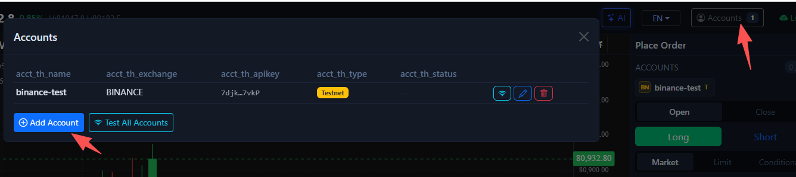
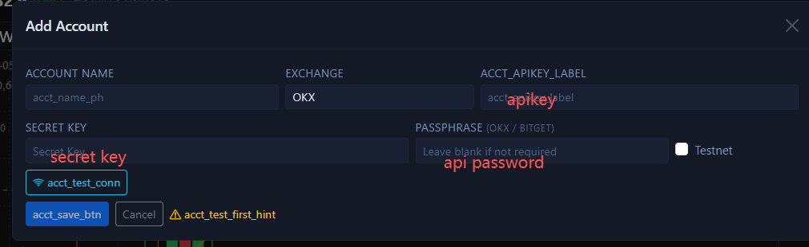
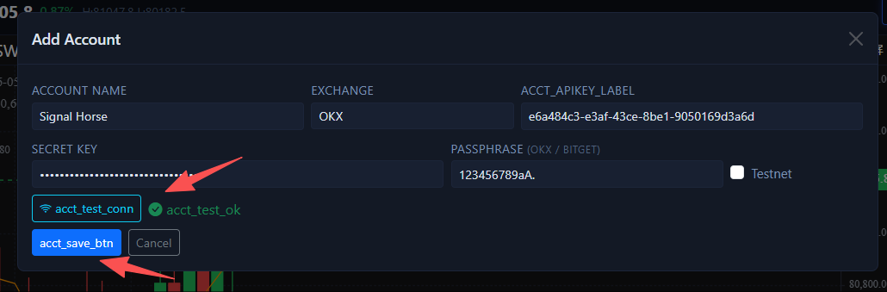
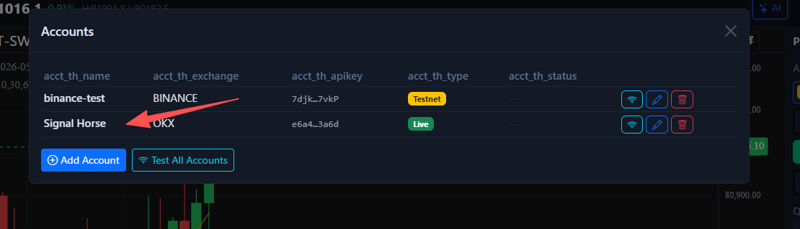

# Add the Keys to SignalHorse

After the exchange gives you the API key and secret key, this page shows how to connect them to SignalHorse.

## Open the account form

1. Open the local UI.
2. Open the `Accounts` window and start a new account entry.

## Fill in the exchange credentials

1. Select the exchange and environment.
2. Paste the `API Key` and `Secret Key` into the corresponding fields.
3. Only `OKX` and `Bitget` require the additional `Passphrase` or API password field.

## Test and save

1. Click `Test Connection` first.
2. After the test succeeds, save the account configuration.

3. After saving, the account should appear in the account list.

If the account is visible and the connection test passed, continue with [Add Accounts](../add-account.md) or [Manual Trading](../manual-trading.md).