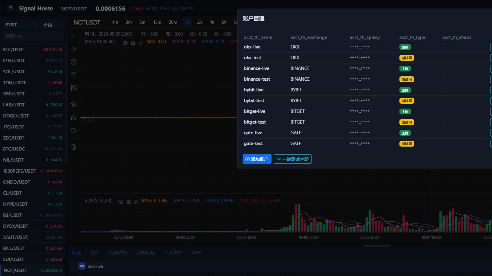
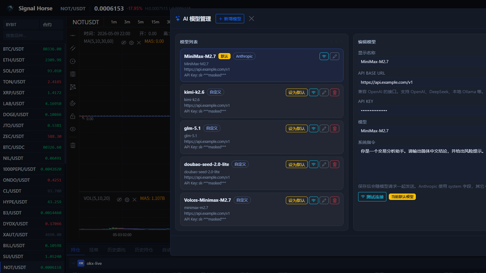

# 界面导览

这一页只做一件事：帮你在第一次打开 Signal Horse UI 时，迅速知道每个区域是干什么的，以及第一次应该先点哪里。

!!! tip "先按图认识，再操作"
    第一次使用时，不要急着下单。先把这张总览图对应到你自己的页面，再按本页顺序逐块熟悉。

当前主界面可以理解成四块：

1. 顶部状态与入口栏
2. 左侧交易对侧栏
3. 中央图表与 AI 分析区
4. 底部数据标签页与右侧下单面板

## 顶部状态与入口栏

顶部区域通常包含这些入口：

- 当前交易对、最新价格、涨跌幅和高低点。
- `AI` 按钮：进入 AI 模型管理和连接测试。
- 语言切换按钮。
- `账户` 按钮：打开账户管理窗口。
- 在线状态提示。

!!! tip "先看账户数量"
    如果右上角账户按钮旁边已经显示数量，说明本地已经保存过账户。第一次使用时，这里通常是空的。

## 左侧交易对侧栏

左侧用于选择“你在看什么市场”。当前结构包括：

- 交易所选择，例如 `OKX`、`BINANCE`、`BYBIT`
- 市场类型选择：`swap` 或 `spot`
- 交易对搜索框
- 交易对列表和最新价格

建议操作顺序：

1. 先选交易所。
2. 再选 `spot` 或 `swap`。
3. 再搜索和点击交易对。
4. 最后再去右侧下单区操作。

不要先在错误市场类型下下单。很多“为什么数量不对”或者“为什么看不到仓位”的问题，本质上就是 `spot` 和 `swap` 切错了。

## 中央图表区

中央区域是界面的核心。这里通常包括：

- 时间周期按钮，如 `15m`、`1h`、`4h`
- 主图表容器
- 指标、时区、设置、截屏、全屏等工具入口
- 图表下方成交量区域
- 右下角 AI 快捷入口

### 图表区能做什么

- 切换周期查看不同时间框架走势。
- 配合左侧交易对列表快速切换标的。
- 用图表工具区控制查看方式。
- 在需要时调用 AI 分析或自动做单入口。

### 图表区第一次建议怎么用

1. 先确认左侧交易所和市场类型已经正确。
2. 在中心区域切到你习惯的周期，例如 `15m` 或 `1h`。
3. 先只观察价格、成交量和周期切换是否正常。
4. 你确认看盘没问题后，再去账户、下单和 AI 区域。

!!! warning "AI 只是辅助层"
    AI 入口是分析辅助，不是正确率保证。最终是否执行，仍然要看你的账户状态、交易所返回和历史记录。

## 底部标签页

底部面板是“看账户和执行结果”的地方。它当前至少覆盖这些标签页：

- `持仓`
- `挂单`
- `订单历史`
- `仓位历史`
- `自动做单`
- `余额`

### 持仓

这里会按账户分组展示：

- symbol
- 多空方向
- 数量
- 开仓价 / 标记价 / 强平价
- 未实现盈亏
- 杠杆和保证金模式
- 当前 TP / SL

你也可以在这里直接：

- 打开 TP/SL 设置
- 快速平仓
- 观察当前仓位对应的杠杆和保证金模式

### 挂单

这里看当前还没成交的普通挂单和部分条件单，并支持撤单。

### 订单历史 / 仓位历史

这两页适合做“执行确认”：

- 订单历史回答“有没有发出去、有没有成交”。
- 仓位历史回答“仓位最后是怎么结束的、盈亏是多少”。

### 自动做单

这里是 Bot 任务的集中管理区。你可以：

- 查看当前有多少 Bot
- 看哪些 Bot 正在运行
- 创建快速 Bot 或高级 Bot
- 启动、停止、删除任务
- 进入某个 Bot 的详细配置

### 余额

余额页会按账户分组，并显示：

- 币种
- 总额 / 可用 / 冻结
- 估算价格
- 在账户中的占比

## 右侧下单面板

右侧是手动交易执行区。当前实现里包括几类关键控件：

- 账户选择器，可多选账户
- `开仓 / 平仓` 切换
- `多 / 空` 或 `买 / 卖` 方向切换
- 数量、杠杆、保证金模式等输入项
- 市价 / 限价 / 条件单相关参数
- `TP / SL` 开关
- 刷新数据与批量工具入口

### 使用右侧面板时最关键的两件事

1. 先确认选中的账户是不是你要操作的账户。
2. 再确认当前页面左侧选的是 `spot` 还是 `swap`。

如果这两件事没确认，后面的任何价格和数量检查都不可靠。

### 右侧面板最常用的顺序

1. 选账户。
2. 选 `开仓` 或 `平仓`。
3. 选 `做多` / `做空` 或买卖方向。
4. 选订单类型。
5. 输入数量、杠杆、保证金模式。
6. 需要时打开 `TP / SL`。
7. 点击执行后，到底部标签页核对结果。

## 账户管理窗口

从顶部 `账户` 按钮进入后，你会看到账户管理窗口。这里是日常接入和维护账户的主入口，常用动作包括：

- 查看已保存的交易所账户列表。
- 区分主网账户和测试网账户。
- 新增账户。
- 批量测试全部账户联通性。
- 编辑、单独测试或删除某个账户。

如果你刚装好程序，建议先只添加 1 个测试网账户，测通之后再继续添加其他账户。

## AI 模型管理窗口

从顶部 `AI` 按钮进入后，可以管理模型列表和默认模型。这个窗口主要用来做四件事：

- 添加或删除模型配置。
- 设置默认模型。
- 测试模型连接是否可用。
- 保存系统提示词和模型参数。

如果你只是先熟悉交易界面，可以暂时不配置 AI。先把账户、看盘和手动交易跑通，再回来配置模型更稳妥。

## 第一次使用 UI 的推荐观察顺序

1. 看右上角是否已有账户。
2. 在左侧选交易所和市场类型。
3. 在中间切到正确交易对和周期。
4. 打开账户窗口，确认你准备用哪个账户。
5. 在底部看余额和持仓是否正常读取。
6. 最后才去右侧下单。

下一步建议继续看 [添加账户](add-account.md) 或 [手动交易](manual-trading.md)。