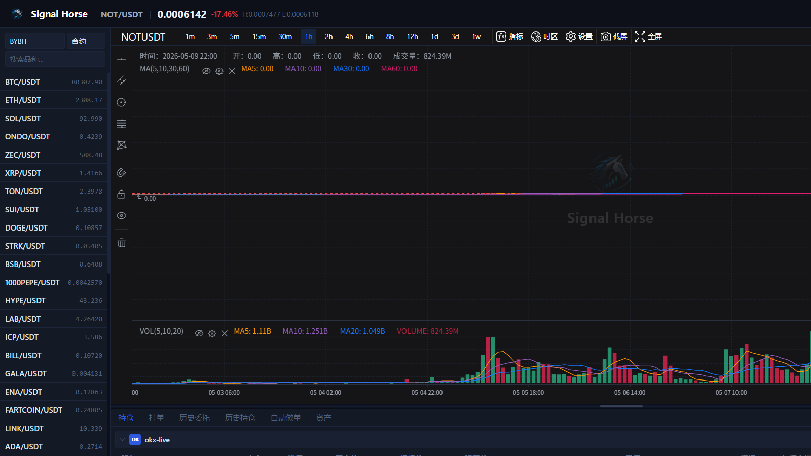

# Signal Horse 用户手册

Signal Horse 是一个本地优先的加密交易工作台。这份手册以 `rust_executor` 提供的本地 UI 使用为主，重点讲清楚怎么在界面里看盘、切交易对、管理账户、手动下单、使用 AI 与查看执行结果。

!!! note "截图说明"
    本手册里的界面截图来自测试环境，目的只是帮助你理解界面布局和操作入口。你自己的账户、价格、持仓和 AI 配置会与截图不同。

!!! tip "建议阅读顺序"
    1. 先看 [首次启动](getting-started/first-run.md)，确认你已经能打开本地 UI。
    2. 再看 [界面总览](guides/ui-tour.md)，先认清每个区域是干什么的。
    3. 然后从“界面详解”里按区域看你最常用的功能页。
    4. 接着看 [添加账户](guides/add-account.md) 和 [手动交易](guides/manual-trading.md)，跑通一次最小交易流程。
    5. 最后再看 [AI 与自动化](guides/ai-automation.md)。

## 这套系统能做什么

- 在本机浏览器里打开统一交易界面。
- 在同一页面里切换交易所、市场类型、交易对和周期。
- 通过账户管理窗口统一接入 `OKX`、`Binance`、`Bybit`、`Bitget`、`Gate.io`。
- 在右侧下单区执行手动交易、设置 TP / SL，并用底部标签查看持仓、挂单、历史和资产。
- 通过顶部 `AI` 和底部 `自动做单` 入口使用模型分析和自动化任务。

## 快速事实

| 项目 | 当前约定 |
| --- | --- |
| 本地 UI 地址 | `http://127.0.0.1:38182/` |
| 健康检查 | `GET /health` |
| 根路径行为 | `GET /` 当前同时作为 UI 入口和健康别名 |
| Windows 主发布物 | `signal_horse_windows_portable.zip` |
| Windows 启动脚本 | `Start Signal Executor.cmd` |
| Linux / macOS 一键安装 | `https://signal.horse/install.sh` |
| Windows 一键安装 | `https://signal.horse/install.ps1` |

## 适合谁使用

- 想在自己的电脑上运行交易工具，而不是把密钥发到远程服务的用户。
- 想通过浏览器进行手动交易和状态查看的操作者。
- 想把本地执行器接给 OpenClaw、Claude Code、Codex 或其他 AI 工作流的人。

## 文档范围

这套文档聚焦于“怎么打开本地 UI、怎么理解界面、怎么配置账户、怎么手动交易、怎么使用 AI 和自动化”。

它不覆盖：

- 每个交易所适配器的底层实现细节。
- Windows / macOS / Linux 打包脚本内部实现。
- 站点后台、分析面板或管理侧逻辑。

如果你只是普通使用者，可以先跳过 API。只有在你要做脚本联调、二次开发或 AI 工具接入时，再看 [API 附录（高级）](reference/api.md)。

## 文档地图

如果你是普通使用者，建议按这条路径阅读：

1. [首次启动](getting-started/first-run.md)
2. [界面总览](guides/ui-tour.md)
3. [顶部状态栏](guides/top-bar.md)
4. [市场与交易对侧栏](guides/market-sidebar.md)
5. [图表与周期工具](guides/chart-workspace.md)
6. [右侧下单面板](guides/order-panel.md)
7. [持仓页](guides/positions-tab.md)
8. [挂单页](guides/open-orders-tab.md)
9. [历史委托页](guides/order-history-tab.md)
10. [历史持仓页](guides/position-history-tab.md)
11. [自动做单页](guides/auto-trade-tab.md)
12. [资产页](guides/assets-tab.md)
13. [账户管理窗口](guides/account-center.md)
14. [AI 模型窗口](guides/ai-model-center.md)
15. [添加账户](guides/add-account.md)
16. [手动交易](guides/manual-trading.md)
17. [AI 与自动化](guides/ai-automation.md)
18. [更新与维护](guides/update-maintenance.md)
19. [API 附录（高级）](reference/api.md)

## 当前手册已经覆盖的主题

- 主界面每个核心区域和底部每个主标签页
- 账户管理、测试网与连通性验证
- 手动下单、TP / SL、批量清理和结果核对
- AI 模型管理、AI 分析和自动做单入口
- 更新维护和高级 API 附录
